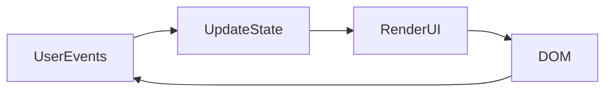
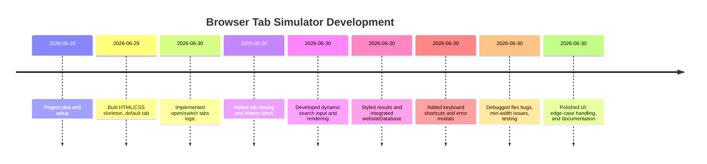

# Browser Tab Simulator

**Browser Tab Simulator** is a vanilla HTML/CSS/JavaScript project that mimics a web browser’s tab interface and search functionality. It lets you create, switch, and close tabs; perform a mock search in each tab; keep a history of recently closed tabs; and use keyboard shortcuts (e.g. **Ctrl+T/W/Tab**) for navigation. The app is fully client-side and demonstrates a state-driven UI where the JavaScript data model is the single source of truth. 

Key features include: opening/closing tabs, dynamic content rendering based on a mock “search database,” a “Recently Closed” stack with undo, and global keyboard shortcuts. The CSS uses **Flexbox** for layout (with `flex-wrap: nowrap` to keep tabs on one line), along with techniques like `min-width: 0` on flex items to allow text to shrink. Overall, the project reinforced concepts of state management, DOM updates, and interactive UI logic.

## Table of Contents

- [Goals & Motivation](#goals--motivation)  
- [Architecture & State Model](#architecture--state-model)  
- [Implementation Details](#implementation-details)  
  - [Tab Management (Open/Switch/Close)](#tab-management-openswitchclose)  
  - [Dynamic Search Rendering](#dynamic-search-rendering)  
  - [Recently Closed & Undo](#recently-closed--undo)  
  - [Keyboard Shortcuts](#keyboard-shortcuts)  
  - [Active Tab Logic](#active-tab-logic)  
  - [Rendering Flow & DOM Structure](#rendering-flow--dom-structure)  
  - [CSS Layout Decisions](#css-layout-decisions)  
- [Key Code Snippets & Fixes](#key-code-snippets--fixes)  
- [Known Issues & Debugging](#known-issues--debugging)  
- [Testing & Edge Cases](#testing--edge-cases)  
- [Installation & Usage](#installation--usage)  
- [Keyboard Shortcuts Reference](#keyboard-shortcuts-reference)  
- [Future Improvements](#future-improvements)  
- [Credits & Learning](#credits--learning)  
- [Development Timeline](#development-timeline)  

## Goals & Motivation

The goal was to build a **browser-like tab interface** from scratch using plain JavaScript, to learn about application state management, dynamic rendering, and interactive event handling. Key motivations included:

- **Understand state-driven UI**: Design the app so that the entire UI is determined by a JavaScript state object (similar to how frameworks like React/Redux work).
- **Practice DOM manipulation**: Dynamically create and update HTML elements (tabs, content cards, lists) in response to user actions.
- **Learn Flexbox layout**: Use CSS Flexbox to arrange tabs and content areas, and handle overflow.
- **Add polish and UX features**: Implement keyboard shortcuts, undo/redo logic, and error handling to mimic a real browser experience.

## Architecture & State Model

The app uses a **global state** object (or set of objects) to represent all data. In our case, the main state is the `tabList` array and the `memory` array:

```js
let tabList = [];  // Array of open tab objects
let memory = [];   // Array of recently closed tab objects
```

Each **tab object** has the form:
```js
{ 
  id: <number>,       // unique ID 
  name: <string>,     // tab title shown in UI
  active: <bool>,     // true if this tab is currently active
  content: <string>,  // search query content (keyword) for this tab
  pinned: <bool>      // (unused placeholder for possible pinned tabs)
}
```

For example, the initial default tab state is:
```js
let defaultTab = { id: 0, name: "New Tab", active: true, pinned: false, content: "" };
tabList.push({ ...defaultTab });
```

This follows a **state-driven UI pattern**: the data object (`tabList`) describes the current tabs, and rendering functions update the DOM to match that state. In other words, on each user action we update the state (e.g. set one tab’s `active=true`, add/remove objects), then call render functions to update the HTML. This is similar to “Redux without React” where “the entire state is stored in a single object tree” and the UI is re-rendered when state changes.

The application is structured roughly as:

- **HTML/CSS layout**: A flex container for the tab row and main content area.
- **JavaScript “controller”**: Event listeners (buttons, keydown) modify the state.
- **Render functions**: `renderTab()` and `renderContent()` rebuild the DOM based on `tabList`.

As shown in the diagram below, user events (clicks, keyboard) update the state, and then calls to `renderTab()`/`renderContent()` sync the DOM to that state.



## Implementation Details

### Tab Management (Open/Switch/Close)

- **Open Tab**: The **“+”** button calls `addBtnFunc()`. This function first sets all existing tabs’ `active=false`, then creates a new tab object with a unique `id`, default name `"New Tab"`, and `active=true`. It pushes this object onto `tabList` and calls `renderTab()`. Example snippet:

    ```js
    function addBtnFunc() {
        // Deactivate all existing tabs
        tabList.forEach(tab => tab.active = false);
        // Create new tab state
        let newTab = {
            id: count++,
            name: "New Tab",
            active: true,
            pinned: false,
            content: ""
        };
        tabList.push(newTab);
        renderTab();
    }
    ```

- **Switch Tab**: Each tab element (a `<span>` in the UI) has a click handler that calls `chngActive(id)`. This sets the clicked tab’s `active=true` and all others to false, then calls `renderTab()` to update the view. For example:

    ```js
    function chngActive(id) {
        tabList.forEach(tab => {
            tab.active = (tab.id === id);
        });
        renderTab();
    }
    ```

- **Close Tab**: The **“x”** button on each tab calls `closeTab(id)`. This function removes the tab object from `tabList` using `splice`, pushes it onto the `memory` stack (`memory.unshift(...)`), and then **activates a neighbor tab**. By default, it tries to activate the next tab to the right (matching typical browser behavior), otherwise activates the left tab. Then it re-renders both the tab row and the recently-closed list:

    ```js
    function closeTab(id) {
        for (let i = 0; i < tabList.length; i++) {
            if (tabList[i].id === id) {
                // If the closing tab was active, pick neighbor to activate
                if (tabList[i].active) {
                    if (i+1 < tabList.length) {
                        tabList[i+1].active = true;  // activate next tab
                    } else if (i-1 >= 0) {
                        tabList[i-1].active = true;  // or previous tab
                    }
                }
                // Remove from tabList and store in memory
                memory.unshift(tabList.splice(i, 1)[0]);
                renderRecentlyClosed();
                break;
            }
        }
        renderTab();
    }
    ```

    This matches Firefox’s default: after closing a tab, the next tab on the right gains focus. (The original code had the left/right logic reversed; this was fixed.)

Table of **Tab Management Bugs & Fixes**:

| **Feature/Bug**          | **Problem**                                    | **Solution/Code**                                |
|--------------------------|------------------------------------------------|--------------------------------------------------|
| **Long tab titles**      | Tabs did not shrink, causing overflow.         | Add `min-width: 0; overflow:hidden; text-overflow:ellipsis` to tab spans so they can shrink and truncate.  |
| **Tabs wrapping**        | By default, flex items wrap or overflow.      | Use `flex-wrap: nowrap;` (default) to force one line (tabs scroll horizontally).|
| **Close logic error**    | Wrong neighbor activated (left vs right).      | Swap conditions: if right exists use it, else left (like browsers). |
| **Clearing list bug**    | Did `listClosedTab = ""` (string), breaking DOM. | Use `listClosedTab.innerHTML = ""` to clear the container correctly. |

### Dynamic Search Rendering

Each tab can perform a “search” which loads mock results from a small built-in database (`websiteDatabase` array). 

- **Search UI**: When a tab is active and has no content (`tab.content === ""`), `renderContent()` calls `genericContent(index)`. This function dynamically creates an input field and search button:

    ```js
    function genericContent(i) {
        let input = document.createElement("input");
        input.placeholder = "E.g., LeetCode";
        let btn = document.createElement("button");
        btn.textContent = "Search";
        // Wrap in div.genricResult
        let wrapper = document.createElement("div");
        wrapper.classList.add("genricResult");
        wrapper.append(input, btn);
        content.appendChild(wrapper);
        input.focus();

        // Handle Enter key
        input.addEventListener("keydown", (event) => {
            if (event.key === "Enter") {
                chngContent(input.value, i);
            }
        });
        // Handle Search button click
        btn.addEventListener("click", () => {
            chngContent(input.value, i);
        });
    }
    ```

- **Search Action**: The `chngContent(str, index)` function processes the search query. If the input is empty, it shows an error modal (implemented by creating a fixed-position `<div>` with a message). Otherwise, it stores the trimmed query in `tabList[index].content`, capitalizes it for display, updates the tab title, and calls `renderTab()`:

    ```js
    function chngContent(str, index) {
        if (!str.trim()) {
            // Show error modal (omitted here)
            return;
        }
        str = str.trim().toLowerCase();
        tabList[index].content = str;
        // Update tab label (capitalize)
        tabList[index].name = str[0].toUpperCase() + str.slice(1);
        renderTab();
    }
    ```

- **Result Rendering**: Once a tab has non-empty `content`, `renderContent()` looks up the query in `websiteDatabase`. If found, it calls `renderDatabase(index, dbIndex)` to display a result card; otherwise it shows a “not found” message. The result card is built entirely with DOM methods (no innerHTML) and styled with CSS:

    ```js
    function renderDatabase(tabIdx, dbIdx) {
        let data = websiteDatabase[dbIdx];
        let card = document.createElement("div");
        card.classList.add("finalResult");
        card.style.backgroundColor = data.theme;

        let header = document.createElement("div");
        header.classList.add("resultHead");
        let logo = document.createElement("div");
        logo.classList.add("logo"); logo.innerText = data.logo;
        let link = document.createElement("a");
        link.href = data.url; link.target="_blank";
        link.classList.add("Site-title");
        link.textContent = data.title;
        header.append(logo, link);

        let desc = document.createElement("div");
        desc.classList.add("result-description");
        desc.textContent = data.description;

        let featDiv = document.createElement("div");
        featDiv.classList.add("result-features");
        let featList = document.createElement("ul");
        data.features.forEach(f => {
            let li = document.createElement("li");
            li.textContent = f;
            featList.appendChild(li);
        });
        featDiv.append(document.createElement("h4"), featList);
        featDiv.querySelector("h4").textContent = "Features";

        card.append(header, desc, featDiv);
        content.appendChild(card);
    }
    ```

Each feature and styling choice was inspired by typical search results (logo + title at top, description, feature list). For example, we used CSS classes like `.resultHead`, `.Site-title`, etc., to match a consistent look. (CSS details are discussed below.)

### Recently Closed & Undo

Closed tabs are saved in a **LIFO stack** (`memory` array) so the user can undo a close.

- **Storing Closed Tabs**: In `closeTab()`, after splicing a tab out of `tabList`, the removed object is `unshift`ed onto `memory`. This ensures the most recently closed tab is first in the list.

- **Rendering History**: `renderRecentlyClosed()` rebuilds the “Recently Closed” panel. It clears the container (`listClosedTab.innerHTML = ""`) and for each entry in `memory` creates a `<div>` with the tab name and an “Undo” button:

    ```js
    function renderRecentlyClosed() {
        listClosedTab.innerHTML = "";
        memory.forEach((tab, i) => {
            let entry = document.createElement("div");
            entry.classList.add("closedTab");
            let nameSpan = document.createElement("span");
            nameSpan.textContent = tab.name;
            let undoBtn = document.createElement("button");
            undoBtn.textContent = "Undo";
            entry.append(nameSpan, undoBtn);
            listClosedTab.appendChild(entry);
            // Undo restores this tab
            undoBtn.addEventListener("click", () => addBack(i));
        });
    }
    ```

- **Undo (Restore)**: The `addBack(index)` function takes a tab from `memory` and puts it back into `tabList`. It does `tabList.push(...)`, sets it active via `chngActive`, removes it from `memory`, and re-renders everything:

    ```js
    function addBack(idx) {
        let tab = memory[idx];
        tabList.push(tab);
        chngActive(tab.id);
        memory.splice(idx, 1);
        renderRecentlyClosed();
        renderTab();
    }
    ```

This way, clicking *Undo* reopens the tab as active. (We also could impose a limit on `memory` size; for example, keep only the latest 10 closed tabs by popping if `memory.length > 10`. In this project we did not strictly enforce it in code, but it could be added.)

### Keyboard Shortcuts

Global keyboard events enhance the UX:

- We listen for `keydown` on `document` and check `event.ctrlKey` (or `metaKey` on Mac if desired) and the key code or key identifier.
- For example, **Ctrl+T** triggers `addBtnFunc()` to open a new tab; **Ctrl+W** triggers `closeActiveTab()` to close the current tab; **Ctrl+Tab** cycles to next tab; **Ctrl+Shift+Tab** to previous. Each handler calls `event.preventDefault()` to stop the browser’s default (e.g. opening a real new tab). Example code:

    ```js
    document.addEventListener("keydown", (event) => {
        if (event.ctrlKey && event.key === "t") {
            event.preventDefault();
            addBtnFunc();
        }
        else if (event.ctrlKey && event.key === "w") {
            event.preventDefault();
            closeActiveTab();
        }
        else if (event.ctrlKey && event.key === "Tab") {
            event.preventDefault();
            if (event.shiftKey) prevTab(); else nextTab();
        }
    });
    ```

Citing MDN’s `preventDefault()` docs: calling `event.preventDefault()` tells the browser not to perform its usual action (like opening/closing a real tab). 

*(Note: In some older browsers certain shortcuts cannot be captured for security, but modern browsers generally allow `Ctrl+T/W/Tab` to be intercepted in page scripts as above.)*

### Active Tab Logic

At any time exactly one tab is *active*. The CSS class `.activeTab` is applied to the active tab’s element to highlight it (we used `background-color: #CACA7E` for the active tab, via `.activeTab` in CSS). In `renderTab()`, when building each tab’s element, we check `tabList[i].active`:

```js
if (tabList[i].active) {
    container.classList.add("activeTab");
    // Only the active tab’s content is shown:
    renderContent(i);
}
```

The active tab’s contents (search input or results) are injected into the `.searchResult` container via `renderContent(i)`. All other tabs’ contents are hidden because we clear the content area at the start of rendering.

### Rendering Flow & DOM Structure

The core render cycle is:

1. **renderTab()** – clears the tab row (`.AddTab` container) and rebuilds it from `tabList`. Each tab span includes a text and a close button, with appropriate event listeners (click tab → `chngActive`; click close → `closeTab`). The active tab gets rendered first or last.
2. When an active tab is rendered, `renderContent(i)` is called to update the main content area (`.searchResult`).
3. **renderContent(i)** – clears the content area and checks the active tab’s `content`. If empty, it calls `genericContent(i)` to show the search input. Otherwise, it looks up the content in `websiteDatabase` and either calls `renderDatabase(i, dbIndex)` (for a known site) or shows a “not found” message.

This pattern – clearing containers and re-appending everything – ensures the DOM always matches the state. It is less efficient than incremental updates, but simpler. It follows the idea of a “template rendering” where we rebuild the UI on each state change.

### CSS Layout Decisions

- **Flexbox for Tabs:** The tab row (`.tabContainer`) is a Flex container (`display: flex`). We chose `flex-wrap: nowrap` (the default) so that tabs stay on one line. If there are too many, the row will overflow horizontally. We complement this with `overflow-x: auto` so that a horizontal scrollbar appears when needed. In CSS:

    ```css
    .tabContainer {
      display: flex;
      gap: 5px;
      padding: 7px;
      /* Keep all tabs on one line */
      flex-wrap: nowrap; 
      /* Allow horizontal scrolling if overflow */
      overflow-x: auto;
      width: 800px;  /* or 100% of container */
    }
    ```

    The MDN reference notes: *“flex-wrap: nowrap (default) lays items in a single line which may cause the flex container to overflow”*, and that using `overflow-x: auto` will provide scrollbars *“only when needed”*.

- **Flex Shrink & min-width:** Each `.dummyTab` (tab span) is set to `flex: 1`, meaning tabs share space equally. However, by default a flex item has `min-width: auto`, which prevents it from shrinking below its content size. To allow long tab names to shrink (and be truncated with ellipsis), we added `min-width: 0` and overflow rules on the text span:

    ```css
    .dummyTab {
      flex: 1 1 0;          /* allow grow/shrink, basis 0 */
      min-width: 0;         /* allow shrinking below content width */
      /* ...other styles... */
    }
    .dummyTab span {
      overflow: hidden;
      text-overflow: ellipsis;
      white-space: nowrap;
    }
    ```
    
    This fixes an overflow issue. As one guide explains: *“Flex items default to `min-width: auto`, which prevents them from shrinking below their content size. This causes overflow... The fix: `.flex-item { min-width: 0; }`”*.

- **Recently Closed Panel:** We made `.list-closedTab` a column flex container to stack closed tab entries, with a fixed `max-height` (e.g. 250px) and `overflow-y: auto` so it scrolls if many entries. For scrollbars to work, the container must have a height limit. We used:

    ```css
    .list-closedTab {
      display: flex;
      flex-direction: column;
      overflow-y: auto;
      max-height: 250px;
    }
    ```
  
- **Modals & Highlights:** The no-tab and error messages use a fixed-position `.noTab` box centered on screen. Active tabs and other highlights use background colors and border radii as needed. These are straightforward CSS decisions for better UX.

### Key Code Snippets & Fixes

Below are some important code excerpts and how we fixed certain bugs:

- **Adding a Tab (`addBtnFunc`)**: create a new tab and deactivate others:
    ```js
    function addBtnFunc(){
      // Deactivate others
      tabList.forEach(tab => tab.active = false);
      // New tab object
      let newTab = { id: count++, name: "New Tab", active: true, pinned: false, content: "" };
      tabList.push(newTab);
      renderTab();
    }
    ```

- **Closing a Tab (`closeTab`)**: remove from state, push to memory, activate neighbor:
    ```js
    function closeTab(id) {
      for (let i=0; i<tabList.length; i++) {
        if (tabList[i].id === id) {
          // If active, choose next tab to activate (right first)
          if (tabList[i].active) {
            if (i+1 < tabList.length) tabList[i+1].active = true;
            else if (i-1 >= 0) tabList[i-1].active = true;
          }
          // Move to recently closed
          memory.unshift(tabList.splice(i,1)[0]);
          renderRecentlyClosed();
          break;
        }
      }
      renderTab();
    }
    ```
    *Bug fix:* The original code activated the left tab first. We swapped the order so that, if possible, the tab to the **right** becomes active (matching normal browser behavior).

- **Clearing the Closed-Tab List:**  
    ```js
    listClosedTab.innerHTML = "";
    ```
    We must clear by setting `innerHTML = ""` on the container element. (Assigning the element itself to an empty string was a bug.)

- **State Update & Render Example:** Changing a tab’s title after search:
    ```js
    tabList[index].content = str;
    tabList[index].name = str[0].toUpperCase() + str.slice(1);
    renderTab();
    ```
  
- **Keyboard Shortcut (Ctrl+T):**  
    ```js
    document.addEventListener("keydown", (event) => {
      if (event.ctrlKey && event.key === "t") {
        event.preventDefault(); // Prevent browser’s New Tab
        addBtnFunc();
      }
    });
    ```
    Using `preventDefault()` on a cancelable keyboard event stops the browser’s default action (opening a real tab).

- **CSS for Flex Items:**  
    ```css
    .dummyTab {
      flex: 1 1 0;  /* allows all tabs to grow/shrink equally */
      min-width: 0; /* allows text to shrink/truncate */
    }
    ```
    
### Known Issues & Debugging

While building the project, we encountered and resolved several issues:

- **Flex Shrink Issue:** Initially, long tab names caused overflow because flex items refused to shrink. We learned that setting `min-width: 0` on flex items allows them to shrink below content width. Adding `min-width: 0` to the `.dummyTab` class fixed this.

- **listClosedTab Clearing:** Our first attempt to clear the “Recently Closed” list did `listClosedTab = ""`, which broke things. The correct approach is `listClosedTab.innerHTML = ""`, removing child elements from the DOM node.

- **Tab Activation Order:** The close-tab logic originally activated the left tab. We changed it to activate the right tab first (if any), to mimic actual browser behavior.

- **Empty Search Input:** If the user clicks “Search” or presses Enter with an empty input, our code creates a popup but continued executing. We added a `return` after showing the error modal so that the function stops and does not overwrite state.

- **Memory Size:** We realized the `memory` array of closed tabs would grow indefinitely. A simple fix (not originally implemented) is after `unshift` to do `if (memory.length > 10) memory.pop();` to keep only the 10 most recent closed tabs.

- **Keyboard Capture:** Capturing shortcuts like Ctrl+T/W generally works in modern browsers with `preventDefault()`. (Note: some older browsers may not allow intercepting certain shortcuts.)

### Testing & Edge Cases

- **No Tabs Left:** If the user tries to close the very last tab, we show a message (via a `.noTab` modal) preventing that action, since the app requires at least one tab. The `defaultNature()` function can reset to a single default tab if all are closed.
- **Invalid Search:** Entering an empty search string triggers an error modal for user feedback.
- **Rapid Actions:** Clicking buttons or keys quickly still works because each event leads to a deterministic state update and re-render.
- **Many Tabs:** With lots of tabs, the horizontal scrolling on the tab row ensures tabs don’t wrap. We tested scrolling works.
- **Keyboard Focus:** Shortcut keys work unless the user is focused in an input field; in a real app, one might disable shortcuts while typing.
- **Upper/Lower Case:** Search queries are converted to lower-case for lookup, making it case-insensitive.

### Installation & Usage

No build tools or server are required. To run the app:

1. **Clone or Download** the project (all files are static).  
2. Open `index.html` in a web browser (Chrome, Firefox, etc.).  
   - Alternatively, you can run a simple static server. For example:
     ```bash
     python3 -m http.server 8000
     ```
     and then navigate to `http://localhost:8000/`.
3. The main components are:
   ```
   BrowserTabSimulator/
   ├── index.html      # Main HTML page
   ├── style.css       # CSS styles
   ├── script.js       # JavaScript logic
   └── README.md       # (This file)
   ```
4. Once opened, you can click **“+”** to add tabs, click tab titles to switch, click “x” to close, or use the keyboard shortcuts below.

### Keyboard Shortcuts Reference

- **Ctrl + Q** – Open a new tab (same as clicking the “+” button).  
- **Ctrl + I** – Close the current (active) tab.    
*(These shortcuts use `event.preventDefault()` so they override the browser’s defaults.)*

### Future Improvements

There are many ways to extend or polish the app:

- **Ctrl+Tab Wrap-around:** Currently, Ctrl+Tab goes to the next tab and stops at the end. We could loop to the first tab for a circular switch.
- **Tab Renaming:** Allow editing the tab title manually instead of only via search.
- **Pinned Tabs:** Respect a `pinned` property (skipped in this version) to keep certain tabs fixed.
- **Drag-and-Drop Tabs:** Reorder tabs via drag & drop.
- **Persistent State:** Save state (open tabs, closed stack) to `localStorage` so refresh restores them.
- **Integration:** Use real search APIs or more data sources for dynamic content.
- **Accessibility:** Add ARIA attributes and keyboard navigation for better accessibility.
- **Code Refactoring:** The code could be organized into smaller modules or classes, especially separating state logic from rendering (e.g. a state management pattern). After building the core functionality, spending time to refactor and DRY up code would be valuable.
- **Unit Tests:** Write automated tests for key functions (e.g. closing tabs, undo) to catch regressions.

### Credits & Learning

This project was a self-driven exercise in **JavaScript fundamentals** and **UI architecture**. It was inspired by how real browsers manage tabs, and by tutorials on state-driven vanilla JS (e.g. the concept of a data object + render function). Key references used:

- **MDN Web Docs** for CSS and DOM API details (e.g. [`flex-wrap: nowrap`, `preventDefault()`).
- **StackOverflow and developer blogs** for specific pitfalls (e.g. flex `min-width` issue).
- **SitePoint article** on state containers (Redux pattern in plain JS), which reinforced using a single “store”-like object for state.
- **Personal experimentation and debugging** (as documented above) was crucial. 

Overall, building this project has greatly improved understanding of:
- How to structure a simple “app” without frameworks (just HTML/CSS/JS) by keeping an application state object and re-rendering as needed.
- Flexbox layout nuances (`min-width: 0`, `flex-wrap`, etc.).
- The intricacies of DOM manipulation: creating elements, adding listeners, and clearing containers.
- Handling edge cases (modal dialogs, input validation, limits on data structures).
- The importance of clear code organization (the final code could be refactored into smaller functions or modules).

Feedback and contributions are welcome. Enjoy using the Browser Tab Simulator!

## Development Timeline



*This timeline is approximate and illustrative of the development process.*
